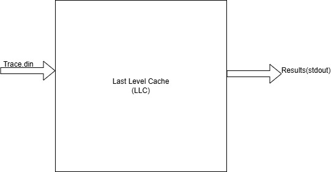

# OVERVIEW
For this project we are designing an LLC simulator that implements the MESI protocol, is write allocated, and maintains cache coherency with its L1 cache.
It is responsible for maintaining proper state transitions of the MESI protocol, messaging to L1, and snooping bus operations from other L2 caches on the bus.
The simulator is run by passing a trace file in (usually with the extension .din) for cache commands that are then read to stdout or a pipelined text file.

Below is a block diagram of the systems operation:

# GOAL
The goal for this project is to build and validate a LLC simulator that meets the following requirements:

1) Implements the MESI protocol and meets all appropriate transitions.

2) Maintains coherency with L1 cache via messaging.

3) Snoops other LLC bus operations and responds according to the MESI FSM.

4) Send bus operations to DRAM as needed.

5) Respond with a HIT/NOHIT/HITM whenever another LLC is reading or reading with intent to modify.

6) Replacement policy (PLRU) is properly implemented and maintains associativity correctly per specs.

7) Report appropriate results at the end base on the spec.

While more specific details may be needed for each sub-category (see testing plan for extensive testing results),
these are the major points that would be required for a fully functional LLC simulator based on the specs provided.
 
# DESIGN
## Overview
All design code was accomplished using C. We broke up the bulk of the work between 2 modules: the cache.c module and the trace.c module.

The cache.c/cache.h module was responsible for maintaining all cache relative operations such as: the MESI protocol, the PLRU replacement policy,
bus operations, and cache coherency operations.

The trace.c/trace.h module was responsible for maintaining all trace read and file I/O operations needed to be consumed by the LLC.

Below is a quick summary of a high level control flow diagram of the design.

## Cache
Cache.h includes header descriptions for all functions used including a breif explanation, input commands, and output results. This should be any
new users first place of examination when determining what is to be used for their code.

Our entry point into the simulator is `void cache(Trace request)` which takes in a trace request or event and iterates to see what of the request commands
given are to be run, these include commands 0-9 as specified in the assignment requirements, but for brevity are provided below quickly:

0 -- L1DataRead

1 -- L1Write

2 -- L1InstructionRead

3 -- Snooped Bus Read

4 -- Snooped Bus Write

5 -- Snooped Bus Read-with-intent-to-modify (RWIM)

6 -- Snooped Invalidate

7 -- local testing debug

8 -- clear the cache and reset states

9 -- print cache

Once a command has been determined we need to go through the logial inferences for each. 

### Processor commands
As the control flow above shows if we have a processor command
then we are going to check if we have the data or not. If the data is not found we must do 2 things. First we need to check if the way is full, and if so
use our replacement policy to evict the way and alert L1 cache to do the same (either via invalidate or evictline for a writeback.) We then need to fetch 
the data from the BUS with either a READ or RWIM command. We then need to send the line back to the L1 cache, and in the case of a write, ask for the 
written line back since the L1 is a write through once. We then update the way with the appropriate state and update our replacement policy.

In the case of a hit we update our hit statistic, and send the line back to L1. In the case of a write, we also request the written line back. We then need
to update that way with the appropriate state and update the replacement policy.

### Snooped Commands
For a snooped command we do a few things:

1) Depending on if it is a READ/RWIM we let the other cache know if we do have the line, and if we do in what state. We also invalidate our line and
tell L1 to invalidate its line if we are in the exclusive or shared states, or we tell L1 to evict the line and invalidate our line if we are in the modified
state. If we are in the modified state with a READ we need to get the line from L1 and write it back as well as signal we have it in the modified state.

2) On a snooped write we do nothing as we cannot have that line in a cohesive protocol.

3) On a snooped invalidate we need to check if we have the line and either invlidate ours and tell L1 to do the same since we only see these in the shared
state.

4) When we snoop a cache clear we need to invalidate our entire cache and reset our replacement policy.

## MESI Protocol
Because we used the MESI Protocol we do not have a dirty or valid bit. We also do not have an inclusivity bit with L1, as we use the messaging. This means
a major part of our design decisions for the protocol relied on us having a solid foundation of this protocol. This involved implementing our case statements
carefully. For this we used case analysis!

Below is our own hand designed FSM table and the class provided FSM Diagram:

With this the design could both use this for the proper case analysis in the FSM logic AND allowed the validation team to verify correct performance. All
state updates have to satisfy the above layout to be considered correct.

## PLRU Replacement Policy
The last major section for the LLC was the replacement policy. While there are many ways to do a LRU replacement, for this project we implemented a PLRU
system. A Pseudo LRU (PLRU) means that we build a tree, and based on the bit stored in the tree location we either traverse to the left or right. When
finding the victim we traverse the tree in reverse. We implemented our tree in an array pattern as shown below:
NOTE: IMAGE CREDITED TO MARK FAUST

We then can calculate the traversal and updates needed by multiplying the index by 2 and adding either 1 or 2 to the result. When getting the victim we
can or the binary results together and use the same algorithm but with the inverted bits (both for the way and the traversal). This last bit is credited
to the homework provided to us by Mark Faust.
# TESTING
For testing we used Traces to validate our system. We used Trace files as both an integration test and isolated unit testing. This was chosen not
because we thought Trace files superior to actual boot straped unit testing (like GTest) but because it allowed the testing team to come up with testing
procedures independent of the design teams philosophy and implementation. Only thing that needed agreed upon was the interfaces defined in the GOALS
section.

Some assumpitons we created when writing our tests: 

1) When we snoop a READ, and we're in the modified state, we send GETLINE to L1. We assume that L1 handles its state appropriately or it doesn't matter.

2) When snooping RWIM we assume that the other cache ignores our HIT/HITM message. This simplifies our circuitry.

3) We assume that for a DIMM the MCU will deal with multiple reads/writes as needed based on cache line.

Below is our testing outline and plan

## Testing Plan

1) PLRU Test Plan

	a) Statement: PLRU initailizes to the proper state

		1) Outcome: PLRU initializes to all 0s on creation

	b) Statment: PLRU traverses the tree correctly on fills and updates

		1) Outcome: PLRU initailizes from way0 to way(n-1) when filling

		2) Outcome: PLRU updates appropriately when doing reads/writes

	c) Statement: On an eviction the MRU is not evicted from the way

		1) Outcome: We never evict the MRU way

		2) Outcome: We evict from the opposite side of the tree we most recently read from

		3) Outcome: Statement 2 applies to every leaf of an eviction path

		4) Outcome: We always return the correct victim

2) Basic Cache Test Plan

	a) Statement: When filling a way with 16 unique tags all accesses should miss

		1) Outcome: We should never see a HIT

		2) Outcome: We should see exactly 16 MISSES for that set

		3) Outcome: Cache set is filled with the corresponding unique tags

	b) Statement: When data is present we should see a hit

		1) Outcome: We should always see a HIT

		2) Outcome: We should never see a MISS

	c) Statement: We should see a miss when data isn't present

		1) Outcome: We should always see a MISS

		2) Outcome: We should never see a HIT

3) Simulation Cache Test Plan

	a) Statement: We respond to processor READS appropriately

		1) Outcome: On a HIT we message SENDLINE to L1

		2) Outcome: On a MISS we broadcast a bus READ and SENDLINE to L1

		3) Outcome: On a MISS if snooped result is HIT or HITM we update to SHARED state

		4) Outcome: On a MISS if snooped result is NOHIT we update to EXCLUSIVE state

		5) Outcome: Outcomes 1-4 hold true regradless of data or instruction L1 processor READ

	b) Statement: We respond to processor WRITES appropriately

		1) Outcome: On a HIT we mesage SENDLINE to L1 and we message GETLINE to L1

		2) Outcome: On a HIT if in SHARED state we send a bus invalidate

		3) Outcome: On a MISS and full and in the MODIFIED state for the victim generate a EVICTLINE 
			to L1 of old address, bus WRITE with old address, bus RWIM for new address, 
			SENDLINE to L1, and GETLINE to L1

		4) Outcome: On a MISS and full and not in the MODIFIED state for the victim send INVALIDATE to
			L1 of victim, send bus operation RWIM for new address, SENDLINE to L1, and GETLINE to L1

		5) Outcome: On a MISS and not full send bus operation RWIM, SENDLINE to L1, and GETLINE to L1

		6) Outcome: For all above outcomes, always move to MODIFIED state

	c) Statement: We respond to Snooped Reads appropriately

		1) Outcome: On a HIT and in the MODIFIED state, we send EVICTLINE with the address to L1, we
				send a bus WRITE

		2) Outcome: On a HIT we move to the SHARED state, or remain in the SHARED state

		3) Outcome: On a MISS we remain in the INVALID state

		4) Outcome: On a MISS we should see no messages to the bus or L1

		5) Outcome: We always send HIT when we have the data and are in either SHARED or EXCLUSIVE state

		6) Outcome: We always send HITM when we have the data and in the MODIFIED state

		7) Outcome: We always send NOHIT when we do not have the data

	d) Statement: We respond to Snooped Writes appropriately

		1) Outcome: We do nothing on a snooped Write, no messages, and no change of state

	e) Statement: We respond to Snooped Read-with-intent-to-modify (RWIM)

		1) Outcome: On a HIT and in the MODIFIED state, we send EVICTLINE with the address to L1, we
				send a bus WRITE

		2) Outcome: On a HIT we move to the INVALID state

		3) Outcome: On a MISS we remain in the INVALID state

		4) Outcome: On a MISS we should see no messages to the bus or L1

		5) Outcome: We always send HIT when we have the data and are in either SHARED or EXCLUSIVE state

		6) Outcome: We always send HITM when we have the data and in the MODIFIED state

		7) Outcome: We always send NOHIT when we do not have the data

	f) Statement: We respond to Snooped Invalidate appropriately

		1) Outcome: On a HIT and in the SHARED state we send INVALIDATELINE to L1, and move to the INVALID
			state

		2) Outcome: On a MISS we should send no L1 message, no bus messages, and should not change state

	g) Statement: We respond to Clear Cache correctly

		1) Outcome: Entire cache state is moved to INVALID

		2) Outcome: After clear, fills operate as normal including PLRU updating

	h) Statement: We respond to Print commands correctly

		1) Outcome: We only print VALID cache lines

		2) Outcome: We never print INVALID cache lines

		3) Outcome: We only print PLRU state for VALID sets

		4) Outcome: We never print PLRU for INVALID sets

		5) Outcome: Printed statements are human readable

	i) Statement: We behave appropriately in NormalMode

		1) Outcome: We print all NormalMode lines when in NormalMode

	j) Statement: We behave appropriately in SilentMode

		1) Outcome: We do NOT print NormalMode lines when in SilentMode

	k) Statement: Messages to the memory is cache aligned

		1) Outcome: Messages to the bus are cache aligned

	l) Statement: We will receive correct statistics at the end of a run

		1) Outcome: We see expected number of HITS

		2) Outcome: We see expected number of MISSES

		3) Outcome: We see expected number of WRITES

		4) Outcome: We see expected number of READS

		5) Outcome: We see expected cache hit ratio

## Test Generation Script
To simplify testing from test plan, test generation script was written. This script can be found in the testing folder under the name `TestGen.c`. To run the script use `make testgen`.
The script uses its own input format to generate an itterative based trace file.

# RESULTS
Results can be found in the Results folder under the Testing directory. While all tests were run, not all tests results have been fully pushed and captured to GitHub. For any personal
testing please push to this directory to maintain operability.

Testing was able to capture and fix bugs to the original design, allowying for a quick itterative approach between the design and test teams.

# TEAMS
Design -- Nathan and Riley

Testing -- Hector and Stephen

Specification and Solutions -- Nathan, Riley, Hector, and Stephen

# FUTURE WORK
Further modularity would be important for true extinsability. This means that the PLRU, bus operations, coherency messages, and coherency policy
should all be their own modular files. Then `#ifdef` can be used to swap in new modular files (such as a counter based LRU) without needing to edit
already existing and working code. This would allow for easier debugging and additions as each new system can be a module (same idea if we wanted
to switch from MESI to MESIF).
